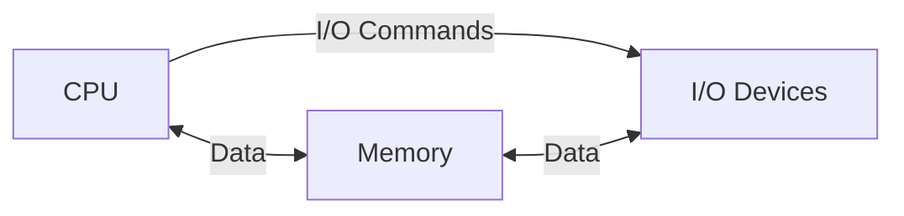

The history of programming is intricately related with the history of computers. Therefore, to understand the meaning, the need & the progress in programming, we first have to understand the history of computer.

# History of Computers & Programming

The 1st computer were huge mechanical & electrical devices that could only do computations but couldn't store any data, not even temporarily.

Scientists would write series of machine instructions in punch cards & insert them in a computer. The computer then reads the instructions & data from the card line-by-line and write the results in output tapes or output punch cards.

Although the speed of those computers are several thousand times slower than your regular PCs, they were still very fast for scientists & engineers of that time.

Scientists realized that the core problems of computers of this mode were:
1. Computations were done by computers very fast, but human beings were found to be many times slower to insert & remove card. So, the computers' full power remained underutilized.
2. A single mistake in the card wasted the card & the time spent on computation.

The sequence of instructions punched in a card were given the name, **Program**.

Note that most early day computers didn't even have monitor. There were no keyboards either. So, they were just doing computations & nothing else. They should give you an idea why the machines you study are historically called **computers**.

The mode of computing using punch card computers were very inefficient & a change was ardently needed.

The famous scientist, **Von Neumann**, then invented the idea of storage 'program' computers. The idea is to use a temporary memory to store the sequence of instructions & the data to apply those instructions on. The central parts of earlier computers that were only doing computations from reading data & instructions from cards then will be modified to load instructions & data from the memory. This modified computation engine is called the **Central Processing Unit (CPUs)**. The result of applying instruction on data are then stored back to the memory. A control unit inside the CPU decides when to load/store data & when to execute instructions on those data.

This famous invention, the very 1st model of modern day computers, is called the **stored program concept**.

Note that monitors started becoming important with the rise of **Personal Computers (PCs)** which came in much later. For many years, scientists were reading computer output in tape drives even after Neumann's famous invention. Invention of PCs later led to the birth of **interactive computing**, meaning a human being can interact with a program that is running inside the computer.

# Capabilities of a CPU

We can say that programming a computer means making use of its CPU capabilities to solve complex multistep computational problems.

From the early days of stored-program computers, or even before, scientists were focused in deciding the basic set of types of instructions that would be sufficient to solve all computational problems we may need to solve.

Remember that these basic instructions must be efficiently implemented in hardware as electronic circuits.

Surprisingly, the basic instructions are very few:
- Regular arithmetic operations.
- Logic operations that give `true`/`false` answers.
- Load/store data to/from memory.
- Skip some instructions from the sequence.
- Go back to an earlier instruction in the sequence.

# Invention of High-level Languages

Initially, scientists used to write their programs directly using binary instructions (representing a sequence of signal/wiring configurations where 0 means electrical ground signal & 1 means high voltage) that are understood by the CPU. Such a sequence of instructions is called a **binary code**.

However, it was becoming very cumbersome to remember CPU instructions in this way. So, scientists named each instruction & each part of the CPU (called a register) that hold data for instructions to read input from & write output to. Scientists then could write sequences of instructions using these names. This form of programming is called **assembly programming**.

An assembler would then convert assembly instruction sequences into binary code which would be run by the computer.

Assembly programming initially saved lots to time. However, scientists later realized that it would be better to write programs using higher level operations that are more intuitive to human beings than writing assembly instructions. This led to the rise of high-level programming languages (for example, C, C++, C#, Java, Python, Fortran, COBOL, BASIC, Visual Basic etc.) that we use today.

# A High-level Program to Machine Code

Basically, users write their programs using a natural language like but formal language. Each instruction in this formal language may be equivalent of several instructions in machine code. Then a program called a **compiler** will translate the high-level program into assembly code. Then an assembler will translate the assembly code into machine code to be run in the computer.

This translator is called a compiler, because compiling is an activity of collecting & arranging parts of a whole. This whole here is a high-level complex instruction & the parts are the many machine instructions that are needed to be emulated in the hardware.

# Impact of High-level Programming Languages

During the era of machine code & assembly programs, programming was mostly done by scientists & engineers who needed to solve complex mathematical problems.

However, with the rise of high-level programming languages, programming became feasible for businesses & real-world applications. From then on, mainframe computers, like the IBM 704, started to enter the industry.

# Features of High-level Programming Languages

Even for high-level programming languages, the principle of having a few basic features that are sufficient to cover all the programs we may want to write is maintained.

This time, the reason for a having a few core features is two-fold:
- Having a few building block features make learning programming easy.
- There must be an efficient conversion from each high-level feature to an assembly instruction sequence.

You will also see that most programming languages support the following features as building block operations:
- Creating variables to refer to locations of memory that hold data of different types.
- Compound arithmetic & logical operations on variables & numbers. (Example: `a = b + c * d /(100.56 - k * y)`)
- User-defined data types & variables of these types.
- Conditional execution (i.e. do something if a condition is false; otherwise, do something else)
- Repeated computations (i.e. same sequence of operations done over and over again on updated or different data)
- Code reuse & structuring features (functions, library imports, etc.)

# History of Interactive Programming

When scientists use computers, the vast majority of programs they write take input at the beginning, then compute for a long time (often for hours or days), and then produce some output at the end. This fact is even true today.

However, as semiconductor-based computers started to replace older computers and the semiconductor technology rapidly became faster & cheaper, average professionals started to use computers for real-life computational problems. This is the time of **desktop computers**.

Unlike scientific problems, real-life programming problems are like a conversation between the computer & the user, where the user provides some input, then the computer does some computations & shows the result, then the user provides subsequent input. This process continues as long as the program runs.

# An example of Interactive Program's Computation

Imagine that you turn the head of the player you're playing in a video game. This happens through some gaming console or keyboard input you pressed. Then the following computations ensues:
1. Recalculate the list of 3D objects in the game scene that should be visible to the game character.
2. From the position & perspective of the character, determine the appeared shape of the objects within the character's eyesight.
3. Determine the impact of the light source reflecting & refracting on the character & the objects.
4. Calculate the shadows & colours of objects in the entire scene.
5. Clip the scene into the part that should fit in the monitor screen.

# How an Interactive Program Works

In an interactive program, the CPU still executes a sequence of machine code instructions by loading data & instructions from memory. The difference is that when an input must be taken from the user or an output must be displayed, the CPU pauses its instruction execution & issues an I/O command.

If it's a display operation, then the CPU loads the display data (characters/pixels) in the memory before issuing the I/O command.

An output device reads the data from the memory & shows/prints it to the user or sends data over the network. In case of an input command, the input device gets input from the user/network & stores the data in the memory.

When the I/O operation completes, the CPU resumes executing operations.

Interactive programming is the reason for rapid interest in better & lighter display technologies and smaller & smaller input technologies. While early generation monitors only supported text display using a single colour, you can now watch HD movies in smartphones.